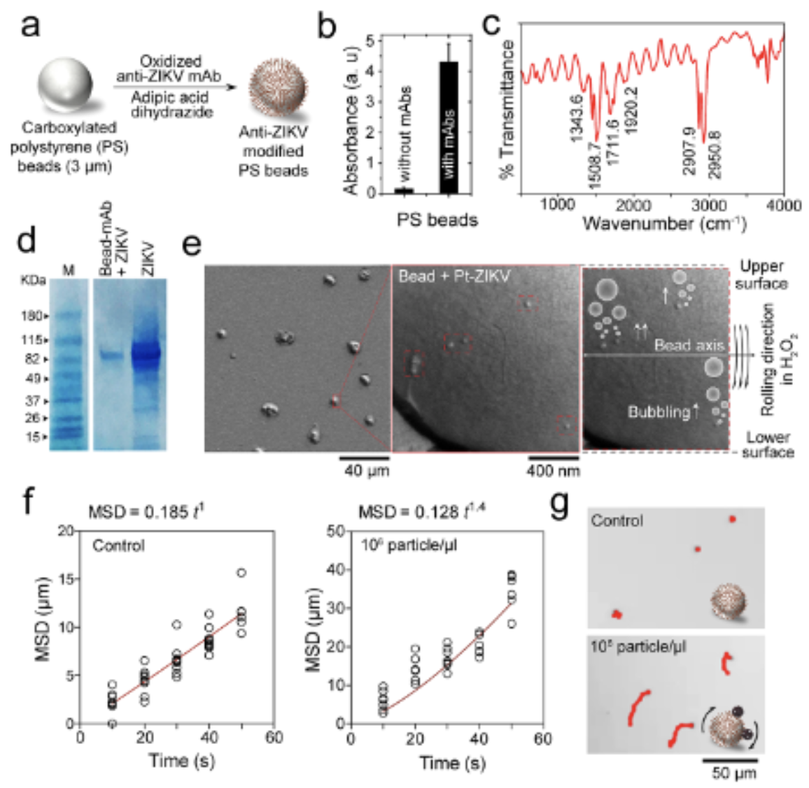
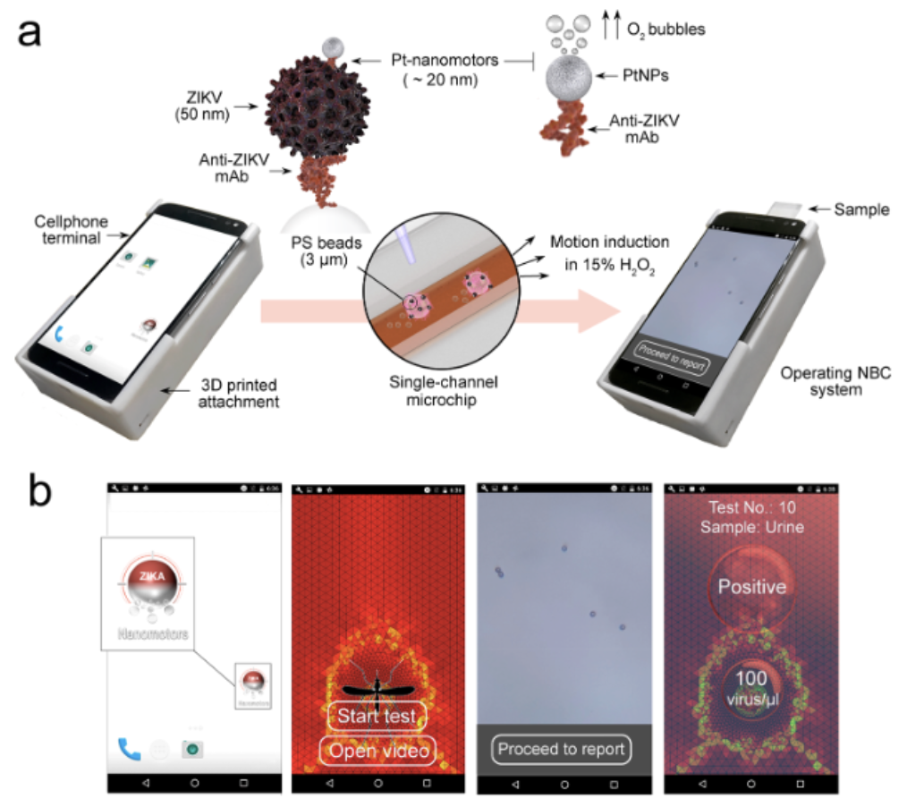
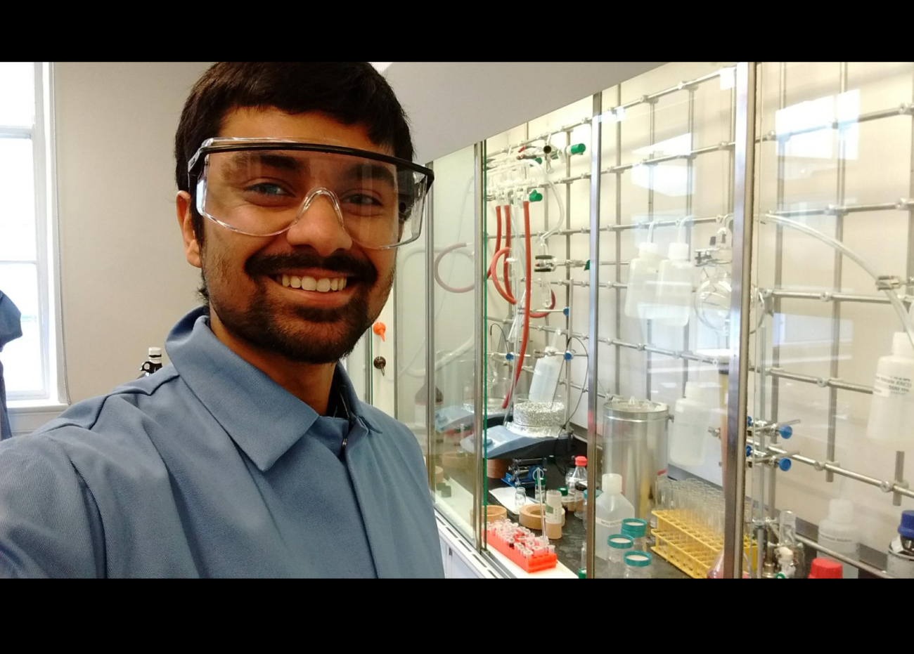

### 5.3 Work @ HMS-BWH
<u>Advisor</u>: Prof. <b>[Hadi Shafiee](https://shafieelab.bwh.harvard.edu/people)</b> 

Designed & synthesized a catalytic Janus Pt/Au nanomotor system for cheap HIV/Zika microfluidic diagnostics. Used Thiol chemistry, Polymerase Chain Reaction (PCR), Loop-mediated isothermal DNA amplification (L.A.M.P.), & particle velocimetry. The microchip is 99% accurate and has been published in ACS nano and Nature communications.

<b> 
<u>Cellphone based point-of-care diagnostics using viral velocimetric techniques coupled with DNA amplification and virus-nanomotor coupling.</u><i> 1) Images reprinted with permission from article journal and original authors. Citation: ACS Nano, 12(6): 5709-5718 (2018) : "Motion-based immunological detection of Zika Virus using Pt-nanomotors and a cellphone" M. S. Draz, N. K. Lakshminaraasimulu, S. Krishnakumar, D. Battalapalli, A. Vasan, M. K. Kanakasabapathy, A. Sreeram, S. Kallakuri, P. Thirumalaraju, Y. Li, S. Hua, X. G. Yu, D. R. Kuritzkes, H. Shafiee</i></b>

<b><u>Catalytic Janus nanomotors for velocimetric diagnosis of HIV/Zika attached nanomotors vs unattached ones.</u><i> 2) Images reprinted with permission from article journal and original authors. Citation: Nature Communications, 9(1): 4282 (2018) : "DNA-engineered micromotors powered by metal nanoparticles for motion-based cellphone diagnostics" M. S. Draz, K. M. Kochehbyoki, A. Vasan, D. Battalapalli, A. Sreeram, M. K. Kanakasabapathy, S. Kallakuri, A. Tsibris, D. R. Kuritzkes, H. Shafiee</i></b>
 

### 5.4 Work @ CSIR-IICT
<u>Advisors</u>: Prof. <b>[Gokulnath Sabapathi](https://www.iisertvm.ac.in/faculty/gokul?%2Ffaculties%2Fgokul=)</b> and Prof. <b>[Giribabu Lingamallu](https://scholar.google.co.uk/citations?user=fIHcRIwAAAAJ&hl=en)</b> 

Bi-conjugated aromatic Porphyrin and Sapphyrin macro-cycles for Dye-sensitized solar cells - Designed and synthesized a donor-acceptor moiety designed for harnessing solar energy and conducting it through a dithienopyrrole acceptor onto a nanocrystalline TCO (Transparent conductive oxide) scaffold for use in Dye-sensitized solar cells. The entire system was an expanded Porphyrin moiety called Sapphyrin that utilized the alkene bond as a wire to transmit the harnessed photoelectrons to the scaffold to complete the photovolatic circuit.

<b><u> Novel Sapphyrin-Dithienopyrrole based photosensitizer for dye-sensitized solar cells</u><i> 1) Images reprinted with permission from article journal and original authors. Citation: Thesis: Kallakuri. S, "Expanded Porphyrin - Dithienopyrrole based efficient dye sensitized solar cells - design, synthesis and fabrication"</i></b>

 

### 5.5 UG Work @ BITS-Pilani
<u>Advisor</u>: Prof. <b>[Jayanty Subbalakshmi](https://www.bits-pilani.ac.in/hyderabad/jayanty-subbalakshmi/)</b> 

Design and synthesis of templated Polyanilines - A new class of conductive polymeric materials. Our goal here was to create structures that are both conductive and do not have the amorphous nature or brittleness that polymers typically exhibit. We were able to achieve this using synthetic additions to help bind and crystallize the polymer in blocks allowing for easy application of conductive materials, as observed in the SEM images below. 

<b><u> Conductive Polyaniline grafted with a) Trisodium citrate b) PEDOT-PSS c) PEG</u><i> 1) Images reprinted with permission from article journal and original authors. Citation: Thesis: Kallakuri. S, "Design and synthesis of templated Polyanilines - A new class of conductive polymeric materials"</i></b>

 

### 5.6 UG Work 2 @ BITS-Pilani
<u>Advisor</u>: Prof. <b>[Ramesh Babu Adusumalli](https://universe.bits-pilani.ac.in/Hyderabad/rameshbabu/Profile)</b> 

This study was focused on understanding chemical changes to lignin and wood-pulp morphology when they undergo cooking and bleaching through a Kraft process. 

<!---

    

<li class="mainmenu-line">  <a href="Guide_to_Metallurgy" title="Guide to Metallurgy"><b>Metallurgy</b></a> </li>

# Chemystery
# Covid Relief Resources
# Gallery
# Upcoming
# List of reagents
# Semiconductor Basics
# List of python commands
# Simple Python & VBA exercises
## What is this?
## Vankay Puls
### SubSubLevel-->