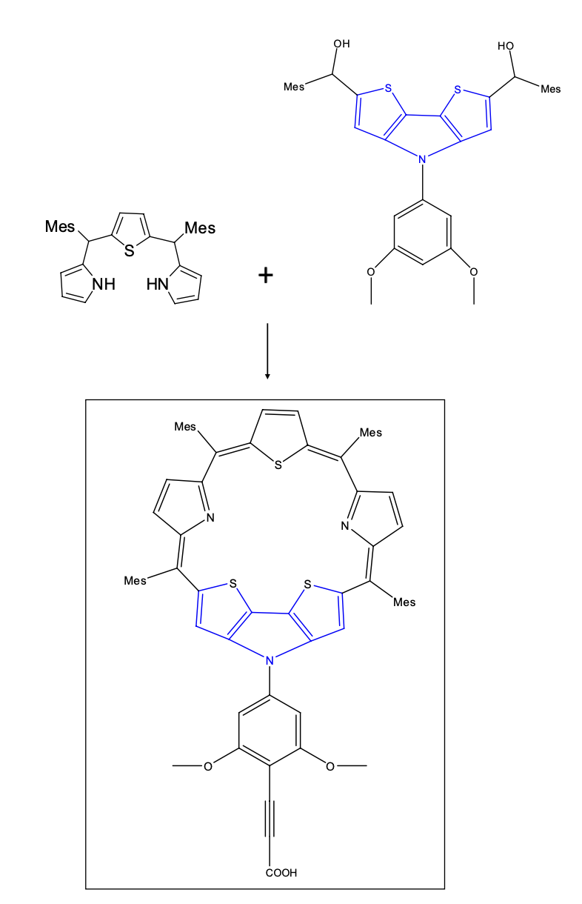
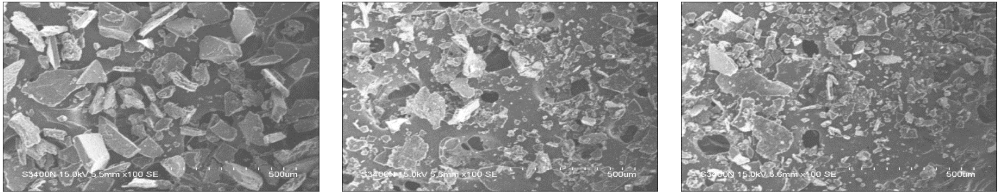
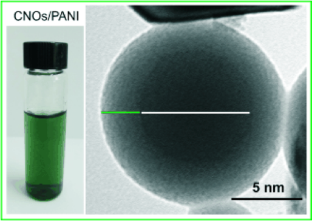

<u>Advisors</u>: Prof. <b>[Hadi Shafiee](https://shafieelab.bwh.harvard.edu/people)</b> 
<u>Institution</u>: Division of Engineering for Medicine, BWH - Harvard Medical School 
<u>Publications</u>: 1) M. S. Draz, K. M. Kochehbyoki, A. Vasan, D. Battalapalli, A. Sreeram, M. K. Kanakasabapathy, <b>S. Kallakuri</b>, A. Tsibris, D. R. Kuritzkes, H. Shafiee. DNA-engineered micromotors powered by metal nanoparticles for motion-based cellphone diagnostics.<b>Nature Communications</b>, 9(1): 4282. [DOI: 10.1038/s41467-018-06727-8](https://doi.org/10.1038/s41467-018-06727-8)  2) M. S. Draz, N. K. Lakshminaraasimulu, S. Krishnakumar, D. Battalapalli, A. Vasan, M. K.
Kanakasabapathy, A. Sreeram, <b>S. Kallakuri</b>, P. Thirumalaraju, Y. Li, S. Hua, X. G. Yu, D. R. Kuritzkes, H. Shafiee. Motion-based immunological detection of Zika virus using Pt-nanomotors and a cellphone.<b>ACS Nano</b>, 12(6): 5709-5718. [DOI: 10.1021/acsnano.8b01515](https://doi.org/10.1021/acsnano.8b01515) 

## Introduction

My contribution in this research was the design, synthesis and chemical-crosslinking of a catalytic Janus Pt/Au nanomotor system to viral DNA for inexpensive point-of-care HIV/Zika microfluidic diagnostics. I was able to achieve this by using Thiol-crosslinking and Azide-coupling chemistry, Polymerase Chain Reaction (PCR), Loop-mediated isothermal DNA amplification (L.A.M.P.), & particle velocimetry. The microchip is 99% accurate in its diagnosis of HIV and Zika viruses. 

## Abstract

> Paper-1: HIV-1 infection is a major health threat in both developed and developing countries. The integration of mobile health approaches and bioengineered catalytic motors can allow the development of sensitive and portable technologies for HIV-1 management. Here, we report a platform that integrates cellphone-based optical sensing, loop-mediated isothermal DNA amplification and micromotor motion for molecular detection of HIV-1. The presence of HIV-1 RNA in a sample results in the formation of large-sized amplicons that reduce the motion of motors. The change in the motors motion can be accurately measured using a cellphone system as the biomarker for target nucleic acid detection. The presented platform allows the qualitative detection of HIV-1 (n = 54) with 99.1% specificity and 94.6% sensitivity at a clinically relevant threshold value of 1000 virus particles/ml. The cellphone system has the potential to enable the development of rapid and low-cost diagnostics for viruses and other infectious diseases.

[Article](https://doi.org/10.1038/s41467-018-06727-8){: .btn--research} [Publication](/files/pdf/research/DNA-engineered-micromotors-powered-by-metal-nanoparticles-for-motion-based-cellphone-diagnostics.pdf){: .btn--research} [Supplemental Information](/files/pdf/research/DNA-engineered-micromotors-powered-by-metal-nanoparticles-for-motion-based-cellphone-diagnostics-si.pdf){: .btn--research}

> Paper-2: Zika virus (ZIKV) infection is an emerging pandemic threat to humans that can be fatal in newborns. Advances in digital health systems and nanoparticles can facilitate the development of sensitive and portable detection technologies for timely management of emerging viral infections. Here we report a nanomotor-based bead-motion cellphone (NBC) system for the immunological detection of ZIKV. The presence of virus in a testing sample results in the accumulation of platinum (Pt)-nanomotors on the surface of beads, causing their motion in H2O2 solution. Then the virus concentration is detected in correlation with the change in beads motion. The developed NBC system was capable of detecting ZIKV in samples with virus concentrations as low as 1 particle/μL. The NBC system allowed a highly specific detection of ZIKV in the presence of the closely related dengue virus and other neurotropic viruses, such as herpes simplex virus type 1 and human cytomegalovirus. The NBC platform technology has the potential to be used in the development of point-of-care diagnostics for pathogen detection and disease management in developed and developing countries.

[Article](https://doi.org/10.1021/acsnano.8b01515){: .btn--research} [Publication](/files/pdf/research/motion-based-immunological-detection-of-zika-virus-using-pt-nanomotors-and-a-cellphone.pdf){: .btn--research} [Supplemental Information](/files/pdf/research/motion-based-immunological-detection-of-zika-virus-using-pt-nanomotors-and-a-cellphone-si.pdf){: .btn--research}

## Previous research @ CSIR-IICT
<u>Advisors</u>: Prof. <b>[Gokulnath Sabapathi](https://www.iisertvm.ac.in/faculty/gokul?%2Ffaculties%2Fgokul=)</b> and Prof. <b>[Giribabu Lingamallu](https://scholar.google.co.uk/citations?user=fIHcRIwAAAAJ&hl=en)</b> 

Bi-conjugated aromatic Porphyrin and Sapphyrin macro-cycles for Dye-sensitized solar cells - Designed and synthesized a donor-acceptor moiety designed for harnessing solar energy and conducting it through a dithienopyrrole acceptor onto a nanocrystalline TCO (Transparent conductive oxide) scaffold for use in Dye-sensitized solar cells. The entire system was an expanded Porphyrin moiety called Sapphyrin that utilized the alkene bond as a wire to transmit the harnessed photoelectrons to the scaffold to complete the photovolatic circuit.

<b><u> Novel Sapphyrin-Dithienopyrrole based photosensitizer for dye-sensitized solar cells</u><i> 1) Images reprinted with permission from article journal and original authors. Citation: Thesis: Kallakuri. S, "Expanded Porphyrin - Dithienopyrrole based efficient dye sensitized solar cells - design, synthesis and fabrication"</i></b>

 

## Previous UG Research @ BITS-Pilani
<u>Advisor</u>: Prof. <b>[Jayanty Subbalakshmi](https://www.bits-pilani.ac.in/hyderabad/jayanty-subbalakshmi/)</b> 

Design and synthesis of templated Polyanilines - A new class of conductive polymeric materials. Our goal here was to create structures that are both conductive and do not have the amorphous nature or brittleness that polymers typically exhibit. We were able to achieve this using synthetic additions to help bind and crystallize the polymer in blocks allowing for easy application of conductive materials, as observed in the SEM images below. 

<b><u> Conductive Polyaniline grafted with a) Trisodium citrate b) PEDOT-PSS c) PEG</u><i> 1) Images reprinted with permission from article journal and original authors. Citation: Thesis: Kallakuri. S, "Design and synthesis of templated Polyanilines - A new class of conductive polymeric materials"</i></b>

 

<!---
UG Research @ BITS-Pilani
<u>Advisor</u>: Prof. <b>[Ramesh Babu Adusumalli](https://universe.bits-pilani.ac.in/Hyderabad/rameshbabu/Profile)</b> 

This study was focused on understanding chemical changes to lignin and wood-pulp morphology when they undergo cooking and bleaching through a Kraft process. 
-->