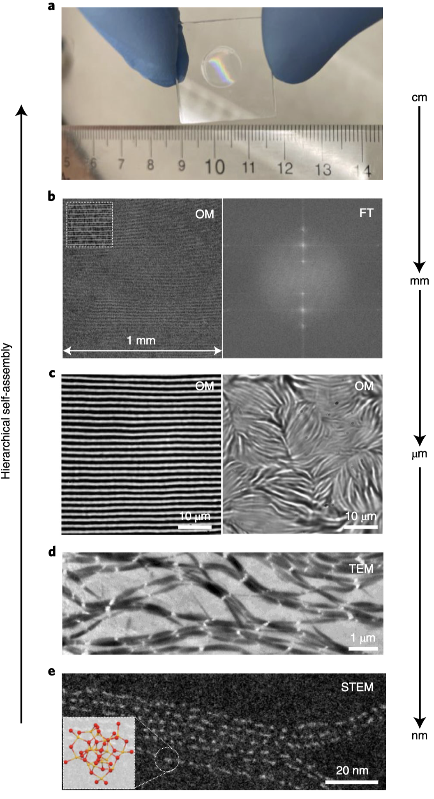
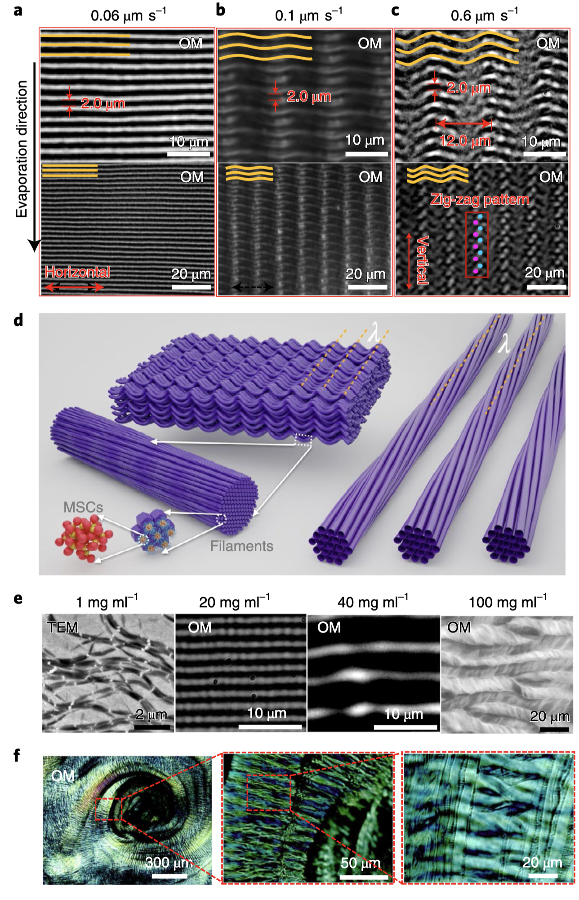
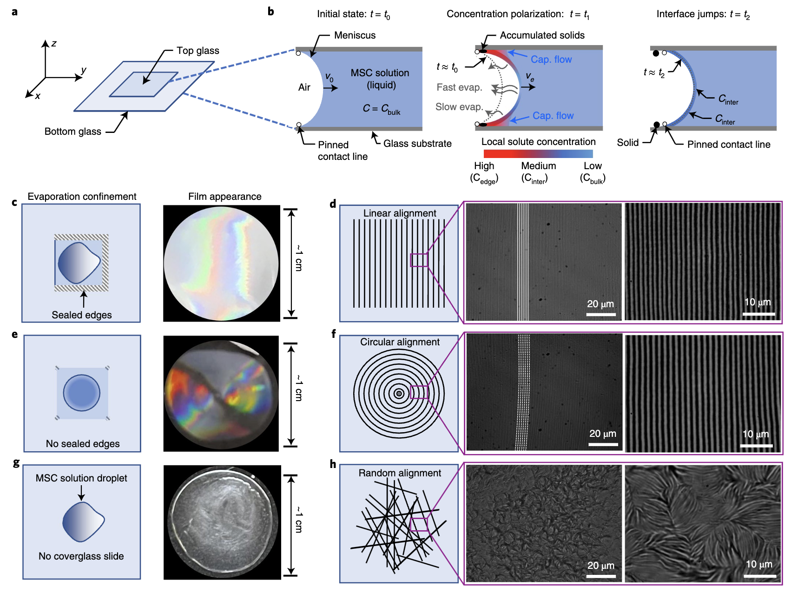
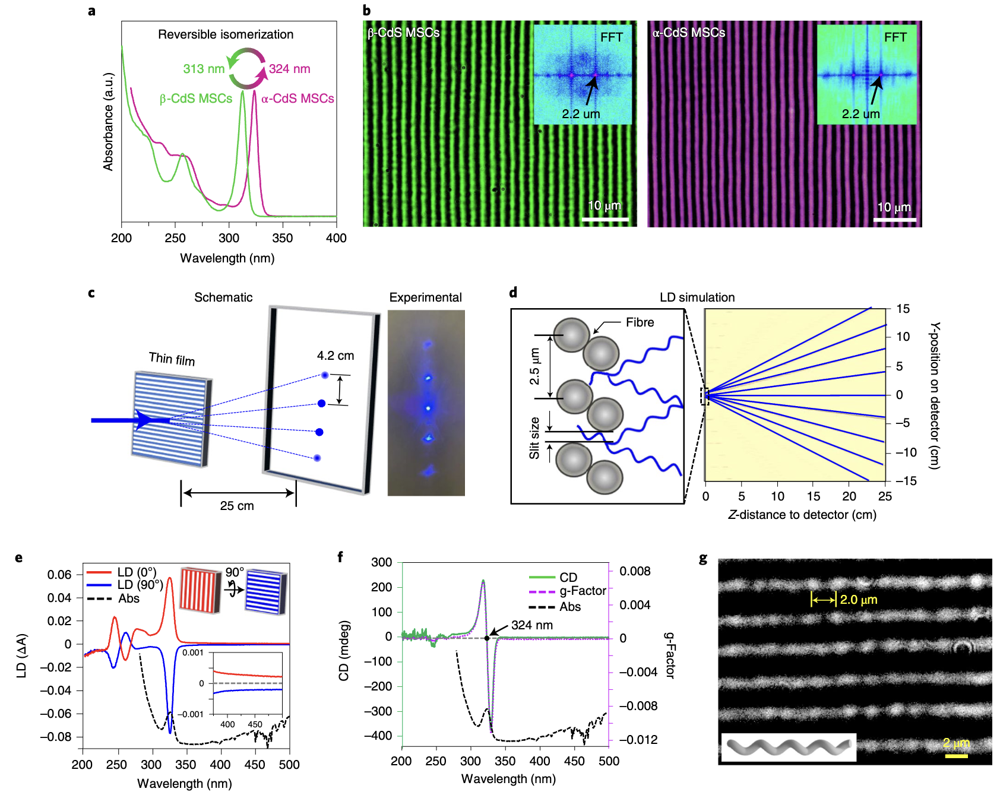

<u>Advisors</u>: Prof. <b>[Richard Robinson](https://www.engineering.cornell.edu/faculty-directory/richard-douglas-robinson)</b> and Prof. <b>[Tobias Hanrath](https://www.cheme.cornell.edu/faculty-directory/tobias-hanrath)</b> 

<u>Institution</u>: Department of Materials Science and Engineering, Cornell University 

<u>MS thesis defense:</u> <b>[Link](https://www.dropbox.com/scl/fi/kichd5dx01smrr645o9p8/MS-M-Exam-Thesis-Defense-Shantanu-Kallakuri.mp4?rlkey=tj8dmz8jkr6wdif9gjhp8qbqh&e=1&st=98ipu85m&dl=0)</b>

<u>Publication</u>: H. X. Han, S. Kallakuri, Y. Yao, C. B. Williamson, D. R. Nevers, B. H. Savitzky, R. S. Skye, M. Xu, O. Voznyy, J. Dshemuchadse, L. F. Kourkoutis, S. J. Weinstein, T. Hanrath, R. D. Robinson. Multiscale hierarchical structures from a nanocluster mesophase. Nature Materials, 21(5): 518-525. [DOI: 10.1038/s41563-022-01223-3](https://doi.org/10.1038/s41563-022-01223-3) 

In this research I investigate (along with post-doc Haixiang Han and team) how chirality can be structurally imparted into bulk materials starting from an atomic-scale in a continuous, unbroken hierarchy. Chirality is essential to both quantum-materials as well as fundamental biological building blocks. Our team had previously made two important discoveries pertaining to inorganic and chiral materials - 1) That it is possible to isomerize inorganic materials in a controlled bistable manner beyond metal-organic/inorganic complexes ([Science](https://www.science.org/doi/10.1126/science.aau9464)) and 2) Concentration can help focus the size of nanoparticles to stable domains that can exhibit this isomerization ([JACS](https://pubs.acs.org/doi/10.1021/jacs.5b10006)). 

We were able to extend this further and demonstrate that these building blocks can spontaneously form thin-films through a filament formation mechanism that wraps these atomically-precise magic-sized nanocrystals in a spin-selective manner to form chiral spin-filters. A key element here is that our method can impart chirality in a structural, scalable, and hierarchical manner irrespective of the chirality of the starting components. This enables key materials building avenues for various applications within biology, quantum information and quantum processing. 

<!-- In this research I ask why, while-->
<!-- I argue that, they realize that; if they, they must --> 
<!-- States are territorial entities, and so the trajectory of will be influenced by the -->
<!-- Knowing this, will push for, while groups whose will -->
<!-- However, are aware of and employ various measures to, such as -->

<!-- To test these arguments, I focus on -->
<!-- By doing so, I am able to exploit -->
<!-- I also explore the temporal dynamics of -->
<!-- I explore how actually conduct using an __ __model to predict when likely to-->
<!-- Such simulation based approaches help us understand the role that can play-->

## Abstract

> Spontaneous hierarchical self-organization of nanometre-scale subunits into higher-level complex structures is ubiquitous in nature. The creation of synthetic nanomaterials that mimic the self-organization of complex superstructures commonly seen in biomolecules has proved challenging due to the lack of biomolecule-like building blocks that feature versatile, programmable interactions to render structural complexity. In this study, highly aligned structures are obtained from an organic–inorganic mesophase composed of monodisperse Cd37S18 magic-size cluster building blocks. Impressively, structural alignment spans over six orders of magnitude in length scale: nanoscale magic-size clusters arrange into a hexagonal geometry organized inside micrometre-sized filaments; self-assembly of these filaments leads to fibres that then organize into uniform arrays of centimetre-scale bands with well-defined surface periodicity. Enhanced patterning can be achieved by controlling processing conditions, resulting in bullseye and ‘zigzag’ stacking patterns with periodicity in two directions. Overall, we demonstrate that colloidal nanomaterials can exhibit a high level of self-organization behaviour at macroscopic-length scales.

[Article](https://doi.org/10.1038/s41563-022-01223-3){: .btn--research} [Publication](/files/pdf/research/2022 - Multiscale hierarchical structures from a nanocluster mesophase.pdf){: .btn--research} [Supplemental Information](/files/pdf/research/2022 - Multiscale hierarchical structures from a nanocluster mesophase - SI.pdf){: .btn--research}

## Impact and Coverage:

Details on this work have been covered in multiple news articles that picked up on it below: 
(<b>[Nature Press](https://www.nature.com/articles/s41563-022-01235-z) &#124; [Cornell News](https://news.cornell.edu/stories/2022/04/nanoclusters-self-organize-centimeter-scale-hierarchical-assemblies) &#124; [Phys.org](https://phys.org/news/2022-04-nanoclusters-self-organize-centimeter-scale-hierarchical.html) &#124; [Eurekalert](https://www.eurekalert.org/news-releases/950527) &#124; [Technology.org](https://www.technology.org/2022/04/17/nanoclusters-self-organize-hierarchy/) &#124; [Newswise](https://www.newswise.com/articles/nanoclusters-self-organize-into-centimeter-scale-hierarchical-assemblies) &#124; [Science News](https://sciencenewsnet.in/nanoclusters-self-organize-into-centimeter-scale-hierarchical-assemblies/) &#124; [Nanowerk](https://www.nanowerk.com/nanotechnology-news2/newsid=60396.php) &#124; [Science Springs](https://sciencesprings.wordpress.com/2022/04/14/from-the-cornell-chronicle-nanoclusters-self-organize-into-centimeter-scale-hierarchical-assemblies/) &#124; [NanoTech Now](https://www.nanotech-now.com/news.cgi?story_id=57033)</b>). Super excited to see this platform realize it's potential!
 

<!--

<b><u> 
Hierarchy of self-assembly of our magic-sized cluster quantum-dot system.</u><i> Images reprinted with permission from article journal and original authors. Citation: Nature Materials, 21(5): 518-525 (2022) : "Multiscale hierarchical structures from a nanocluster mesophase" H. Han, S. Kallakuri, Y. Yao, C. B. Williamson, D. R. Nevers, B. H. Savitzky, R. S. Skye, M. Xu, O. Voznyy, J. Dshemuchadse, L. F. Kourkoutis, S. J. Weinstein, T. Hanrath, R. D. Robinson</i></b>

 

<u>Link to MS thesis defense in case it is not viewable below:</u> <b>[Here](https://www.dropbox.com/scl/fi/kichd5dx01smrr645o9p8/MS-M-Exam-Thesis-Defense-Shantanu-Kallakuri.mp4?rlkey=tj8dmz8jkr6wdif9gjhp8qbqh&e=1&st=98ipu85m&dl=0)</b>

  <iframe width="700" height = "450" src="https://www.dropbox.com/scl/fi/kichd5dx01smrr645o9p8/MS-M-Exam-Thesis-Defense-Shantanu-Kallakuri.mp4?rlkey=tj8dmz8jkr6wdif9gjhp8qbqh&e=1&st=98ipu85m&dl=0"></iframe>

<u><a href="https://www.dropbox.com/scl/fi/kichd5dx01smrr645o9p8/MS-M-Exam-Thesis-Defense-Shantanu-Kallakuri.mp4?rlkey=tj8dmz8jkr6wdif9gjhp8qbqh&e=1&st=98ipu85m&dl=0" target="_blank"><b>Video: Final MS Thesis Defense at Cornell University on "Multiscale Hierarchical Structures from a Nanocluster Mesophase"</b></a></u>

-->

<!--- https://www.dropbox.com/scl/fi/kichd5dx01smrr645o9p8/MS-M-Exam-Thesis-Defense-Shantanu-Kallakuri.mp4?rlkey=tj8dmz8jkr6wdif9gjhp8qbqh&st=98ipu85m&dl=0>

In this thesis my aim was to create a platform of scalable building blocks that could replicate nature's intricate self-assembly and order (as it beautifully happens in <b>[DNA](https://www.nature.com/articles/d41586-017-07690-y)</b>, <b>[Collagen](https://pubs.acs.org/doi/10.1021/la3048104)</b>, or <b>[photonic structures](https://www.nature.com/articles/nature01941)</b>  in butterfly wings) in a controlled and usable manner. While self-assembly is pretty common, creating macroscale structures from the atomic level is <b>[challenging](https://pubs.rsc.org/en/content/articlelanding/2022/nr/d1nr07814c)</b>, especially across the seven orders of magnitude (nanometer to centimeter), which we successfully achieved in Prof. Richard Robinson’s lab at Cornell. Postdoc Haixiang Han and I led the effort using basic lab chemicals instead of costly semiconductor equipment and lithography techniques, along with their analysis, characterization and simulation.

The key challenge was making a building block that could assemble seamlessly across all scales without disruptions caused by factors like <b>[solvent interactions](https://pubs.acs.org/doi/10.1021/jacs.0c09293)</b>, <b>[surface trap states](https://pubs.acs.org/doi/10.1021/acs.jpclett.7b02193)</b>, <b>[zeta potentials](https://www.sciencedirect.com/topics/pharmacology-toxicology-and-pharmaceutical-science/zeta-potential)</b>, or <b>[grain boundaries](https://www.sciencedirect.com/science/article/pii/S2451929420306586)</b> - all very prevalent in bulk materials. We used quantum dot magic-sized clusters (<1nm) bound with long-tailed lipid ligands to <b>[stabilize surface charge](https://pubs.acs.org/doi/10.1021/cm4000476)</b> and create self-assembling 'lego blocks'. By controlling the structure, functional group chemistry and size of these blocks we were able to create a simple one-pot method where these units self-spontaneously go on to form filamental wires that further auto-assemble into thicker ropes and ultimately into large thin films. The final films retained the individual dots' properties, like optical activity and chirality, with >99% purity and minimal loss.
  

<!--- 
<b><i>Hierarchical self-assembly of quantum-dot nanoparticles into defect-free thin-films</i></b>
 -->
<!--- <iframe width="480" height="350" src="../assets/video/self-assembly.mp4" frameborder="0" allowfullscreen></iframe>-->

<!--

 

<b><u> 
Optical, chiroptical, isomeric, and organizational properties of our MSC thin-films.</u><i> Images reprinted with permission from article journal and original authors. Citation: Nature Materials, 21(5): 518-525 (2022) : "Multiscale hierarchical structures from a nanocluster mesophase" H. Han, S. Kallakuri, Y. Yao, C. B. Williamson, D. R. Nevers, B. H. Savitzky, R. S. Skye, M. Xu, O. Voznyy, J. Dshemuchadse, L. F. Kourkoutis, S. J. Weinstein, T. Hanrath, R. D. Robinson</i></b>
 

-->
<!--- <iframe width="480" height="350" src="../assets/video/self-assembly.mp4" frameborder="0" allowfullscreen></iframe>-->

<!--
<video width="580" height="450" controls allowfullscreen poster="../assets/images/pictures/SA.png">
  <source src="../assets/video/self-assembly.mp4" type="video/mp4" />
</video>

<b><u> 
Some MD simulations I had done on LAMPPS & Python with soft potentials to understand ordering of our QD magic-sized clusters.</u><i> Video used with permission from article journal and original authors. Citation: Nature Materials, 21(5): 518-525 (2022) : "Multiscale hierarchical structures from a nanocluster mesophase" H. Han, S. Kallakuri, Y. Yao, C. B. Williamson, D. R. Nevers, B. H. Savitzky, R. S. Skye, M. Xu, O. Voznyy, J. Dshemuchadse, L. F. Kourkoutis, S. J. Weinstein, T. Hanrath, R. D. Robinson</i></b>
 

-->

<!-- [Article](https://doi.org/10.1177/07388942211015242){: .btn--research} [Preprint](/files/pdf/research/Turning the Lights on.pdf){: .btn--research} [Supplemental Information](/files/pdf/research/Turning the Lights on SI.pdf){: .btn--research} [Replication Archive](https://journals.sagepub.com/doi/suppl/10.1177/07388942211015242){: .btn--research} [GitHub Repo](https://github.com/jayrobwilliams/conflict-preemption){: .btn--research} [Poster](/files/pdf/research/PSS 2018 Poster.pdf){: .btn--research}-->

